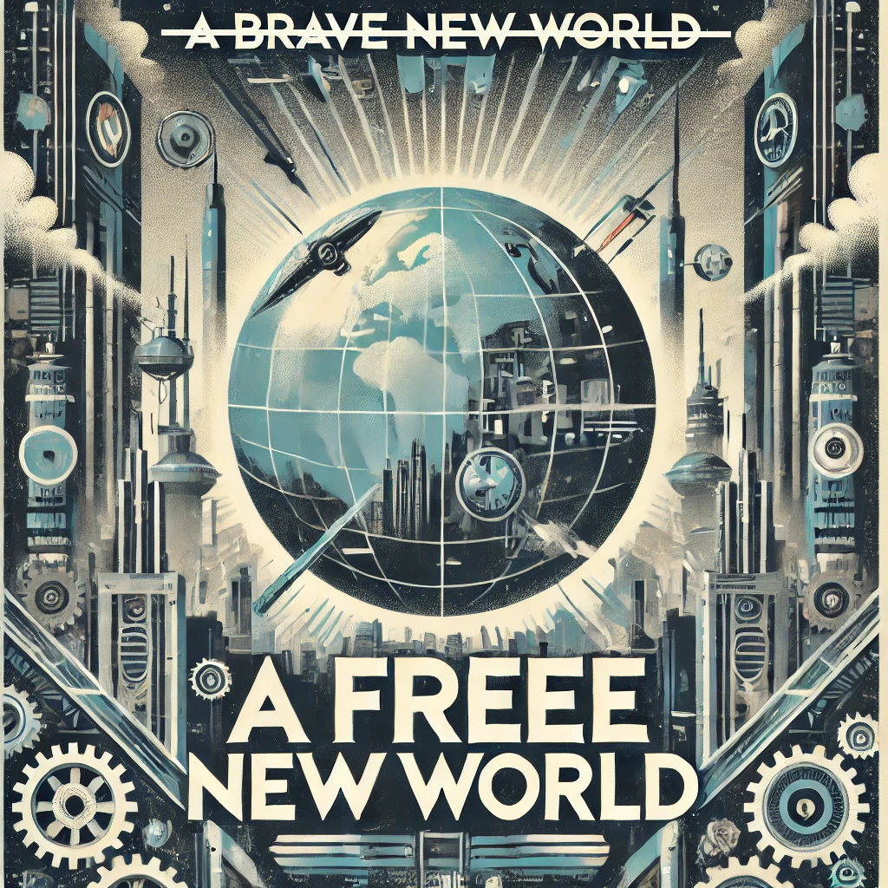
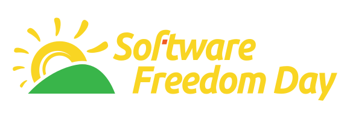

# **A free new world**

## Impactos do software livre no desenvolvimento de software

Repositório desta apresentação https://github.com/andreyev/a-free-new-world

---

_Disclaimer_ :
- Uma GIA(ChatGPT-4) foi usada para confecção desta apresentação.
- As opiniões expressas neste documento são de responsabilidade exclusiva do autor e não refletem necessariamente as opiniões ou posições de quaisquer organizações, instituições ou entidades com as quais o autor esteja associado. As informações e visões apresentadas são de caráter pessoal e não devem ser interpretadas como uma representação oficial ou endosse de quaisquer organizações ou partes externas.

---

# Linus' Law

> "Given enough eyeballs, all bugs are shallow". - Eric S. Raymond, The Cathedral and the Bazaar (1999)

---

# Senta que lá vem história...

---

# Senta que lá vem história begins

* 1950 - 1969: Software acessório
* 1969: Criação do _Unix_
* 1975: fundação da _MS_
* 1976: _An Open Letter to Hobbyists_ do Bill Gates contra pirataria
* 1977: fundação da _Oracle_
* 1980: MS licencia _MS-DOS_ para IBM
* 1982: lançamento do CD
* 1982: criação do projeto _GNU_ pelo Richard Stallman
* 1983: Lançamento do _MS-Word_
* 1985: lançamento do 1o CD-ROM (`Grolier’s Electronic Encyclopedia`)

---

# Senta que lá vem história rises

* 1985: Lançamento do _Windows_ 1.0
* 1989: _FSF_ lança 1a versão da _GPL_
* Anos 1990: popularização da internet
* 1991: Criação das licenças _MIT_ e _BSD_
* 1998: Criação da _OSI_
* 1999: Lançamento da _SalesForce_ (popularização de _SaaS_)
* 2003: Julgamento _SCO_(_MS_) vs _Linux_ (_IBM_ & _RedHat_)
* 2007: Lançamento do _iPhone_ e das _Apps Stores_
* 2010: Lançamento da _Adobe Creative Cloud_ (modelo de assinatura de software)
* ...

---

# Senta que lá vem história 3 returns

* 2004-08-28 primeiro _Software Freedom Day_

---

> SFD is a public education effort with the aim of increasing awareness of Free Software and its virtues, and encouraging its use.

https://en.wikipedia.org/wiki/Software_Freedom_Day

---

# 4 liberdades do software livre (https://pt.wikipedia.org/wiki/Software_livre)

* 0: executar o programa para qualquer propósito;
* 1: estudar o programa e adaptá-lo para as suas necessidades.
* 2: redistribuir cópias do programa de modo que você possa ajudar ao seu próximo;
* 3: modificar (aperfeiçoar) o programa e distribuir estas modificações, de modo que toda a comunidade se beneficie.

---

# Interoperabilidade
## Padrões abertos

* Globalmente:
  * Discutidos
  * Avaliados
  * Validados

---

# Interoperabilidade
## Integração facilitada

* Saindo de _RFCs_
* Para _fork/pull request_

---

# Interoperabilidade
## Eliminação de lock-ins

* Facilitando a migração entre fornecedores
* Facilitando a entrada em um segmento
* DIY

---

# Difusão de conhecimento
## Educação

* Estudar
* Modificar
* Experimentar
* Contribuir

---

# Difusão de conhecimento
## Educação

* Formal ou não
* Síncrona ou não
* Presencial ou não

---

# Difusão de conhecimento
## Educação

* Comunidades colaborativas
* Abrangência variada

---

# Difusão de conhecimento
## Educação

* Evolução
* Pesquisa
* Inovação

---

# Segurança

* Transparência (auditoria pública)
* Respostas coerentes ao impacto (rápidas ou lentas, contundentes ou vagas etc)

---

# Acesso

* "Inclusão digital" (comoditização)
* Redução de barreiras financeiras

---

# Exemplos

* _Moodle_
* _MinIO_
* _LibreOffice_
* _Linux_
* _GIMP_
* _Apache HTTP Server_
* _WordPress_
* _git_
* _React_
* _HTML/XML/JSON_
* _OpenSSL_
* _DHIS2_ (_District Health Information Software_)

---

# DevOps & FOSS?

>  "Um anão sobre os ombros de um gigante pode ver mais longe do que o próprio gigante." - Robert Burton, The Anatomy of Melancholy (1621)

---

# DevOps:

* Colaboração aberta
* Transparência
* Autonomia/automação
* Otimização
* Agilidade
* Inovação
* Cultura de compartilhamento
* > Release early, release often (ESR)

---

# Fontes

- https://github.blog/open-source/social-impact/the-social-impact-of-open-source/
- https://techcrunch.com/2019/01/12/how-open-source-software-took-over-the-world/
- https://medium.com/@ruwan_ranganath/role-of-open-source-in-world-of-devops-talk-at-software-freedom-day-2021-cc28c64aaeb5
- https://en.wikipedia.org/wiki/Open-core_model

---

# Obrigado!!!!!1
Repositório desta apresentação https://github.com/andreyev/a-free-new-world

